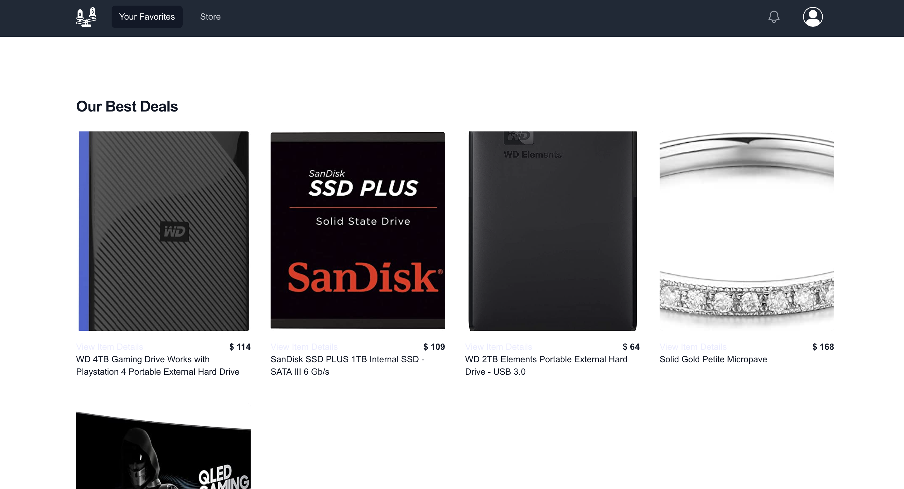
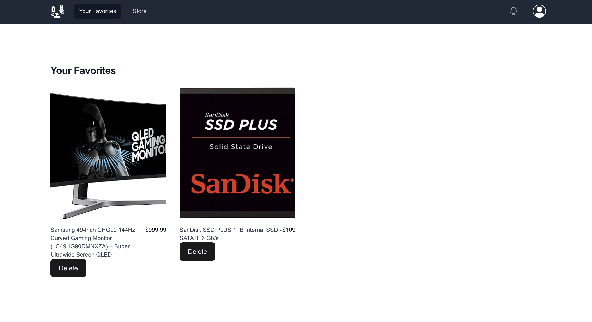
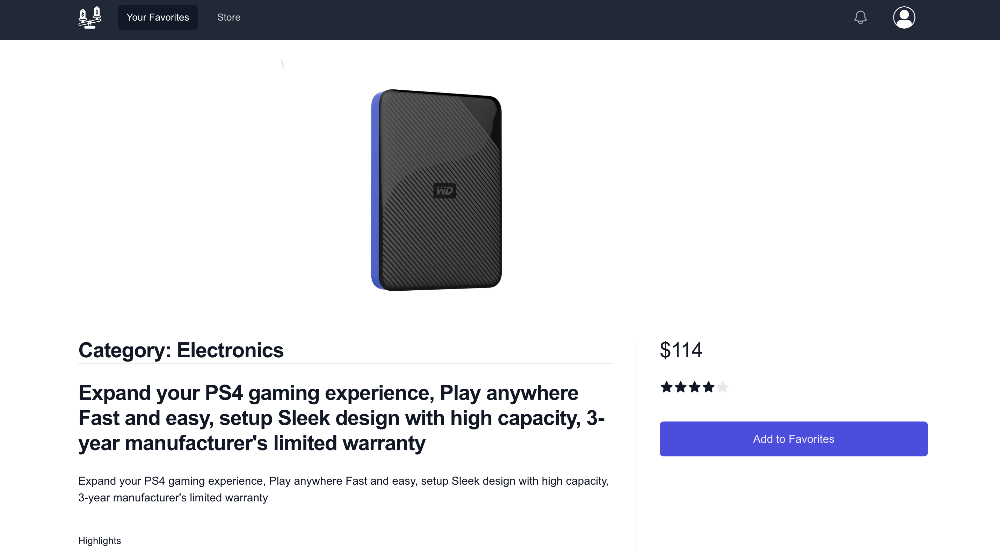
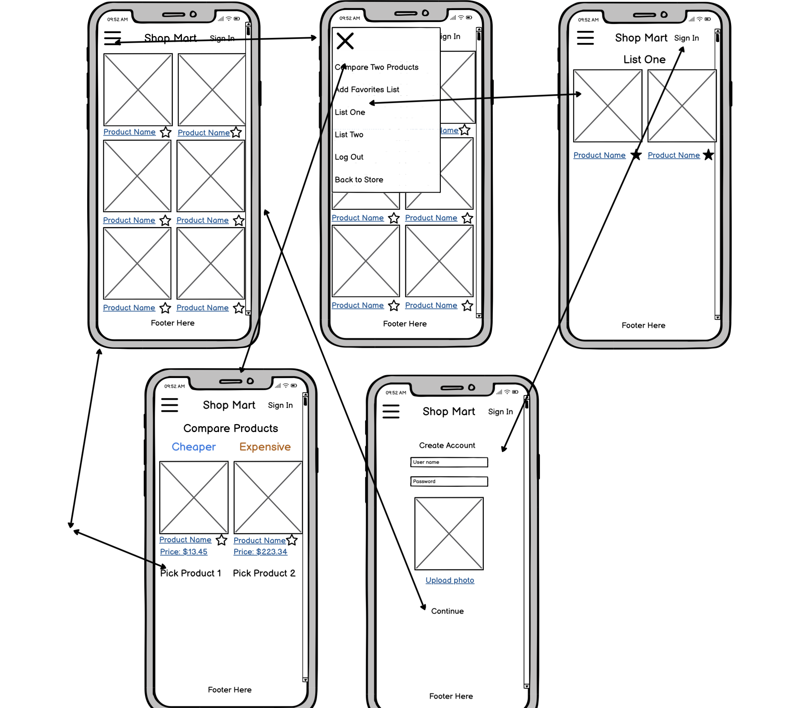

# Product Compare

Description:
Product Compare was a website I envisioned that would host product information from some of the USA's largest retailers such as: Amazon, Walmart, Target, Shein. Users could search for products like any other retailer site and find what they want. Where the site would differ is that users could compare products to find the best deals across different websites, or compare other aspects of a product such as the ability to use a deferred payment plan from companies like Klarna & Affirm. Eventually I had hoped to inform consumers of the different options that were available to pay for the same item, either paying in full with a single purchase, or paying in installments.

Presently the site is slim with only a favorites feature allowing users to add to a favorites list and remove items they don't want. I hope to expand on this project in the future if I can!

Screenshots of core functionality, including descriptions or relevant user stories:

[Title](<../../../../../Desktop/Capstone Demo.mov>)

A summary of technologies / APIS used plus links to the relevant resources (express, mongoose, Auth0, etc) documentation:
APIS:
FakeStore API: https://fakestoreapi.com/

dummyJSON: https://dummyjson.com/docs/products

Other Technologies used:
HTML
CSS
JavaScript
React: https://react.dev/
Vite: https://vitejs.dev/
Express: https://expressjs.com/
MongoDB: https://www.mongodb.com/cloud/atlas/efficiency?utm_content=rlsapostreg&utm_source=google&utm_campaign=search_gs_pl_evergreen_atlas_general_retarget-brand-postreg_gic-null_amers-us-ca_ps-all_desktop_eng_lead&utm_term=&utm_medium=cpc_paid_search&utm_ad=&utm_ad_campaign_id=14383025495&adgroup=129270225274&cq_cmp=14383025495&gad_source=1&gclid=Cj0KCQiAnrOtBhDIARIsAFsSe50-YrRg06tJAYmrKytIQPsCCQvEpfPLltv4BdxLxuvwsUWdx7IiDy8aAtTXEALw_wcB
Mongoose: https://mongoosejs.com/
Node.js: https://nodejs.org/en/about
Netlify: https://www.netlify.com/
Heroku: https://www.heroku.com/platform
Tailwind.css: https://tailwindcss.com/

Instructions for how a person might spin up a copy of your app locally:
If you want to run the app locally you'll need to download the files from the front end and the back end. Additionally you'll need to use the development environment Vite to run the app. After downloading all the files, including Vite, you can run app by logging in your terminal "npm run dev". This will start the front end of the app on your default localhost unless otherwise specifified. For the backend You'll need tow download all the files in addition to the latest verions of Node.js, Nodemon and Express. Once downloaded you can start the backend server using node by running the command "nodemon server.js" in your terminal, this should start the back end. If your front end is already running, refresh the page to begin seeing the content load!

Summary of current user flow / feature list

Features: 
The user can view all available products on the main store page, all products are loaded from the database.

Users can save products they like to a "favorites" list.

Users can delete products they no longer want from their "favorites" list.

A list of your future features / icebox items (edited):
Icebox Items:

There is a page on the website where the user can pick two products to compare -> the user will be brought to a comparison page that has the price, product description, title, and any additional information displayed.

Users can create a profile for the platform. The created profile will be linked to the database with a specific userID and password liked to the profile. No 2 userID's should match, but, users can have the same password.

Links to each product's store page will be saved in the database and passed to the front end to be displayed and rendered on the user's client.
